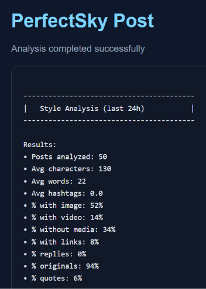

# PerfectSky Post

### Web App  
https://bunesky.github.io/perfectsky-post/

### Preview  
A minimal dashboard showing real‑time style metrics from the Bluesky Trending feed.

### Screenshot  

PerfectSky Post analyzes the posts from the Bluesky Trending feed and provides metrics:

- Character and word averages  
- Media usage (images, video, links, no media)  
- Post types (originals, replies, quotes)  
- Hashtag frequency  

### Feed Source  
https://bsky.app/profile/did:plc:jlyxq2frdkpnkwhzldvmjlrv/feed/aaadxgnfze66k

### Related Projects  
• Web app (analytics + result): https://bunesky.github.io/perfectsky-perfect-post/  
• Bot: https://github.com/Bunesky/perfectsky-post-bot  

### Contact  
https://bsky.app/profile/bune.bsky.social
